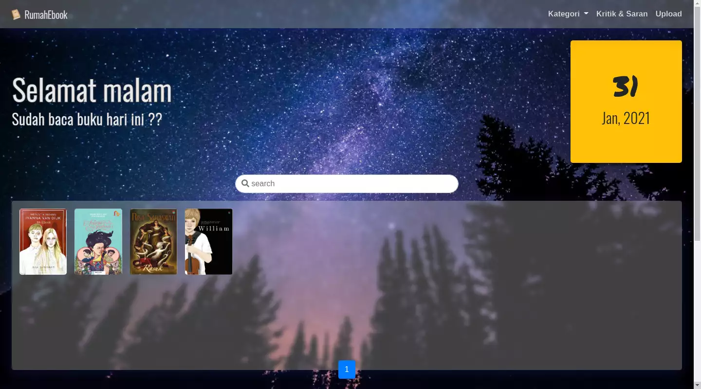
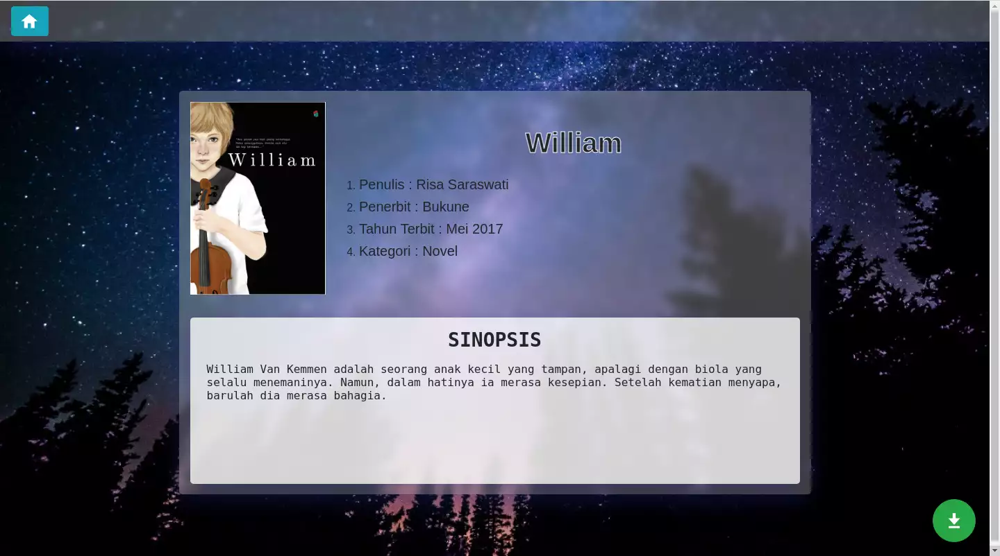
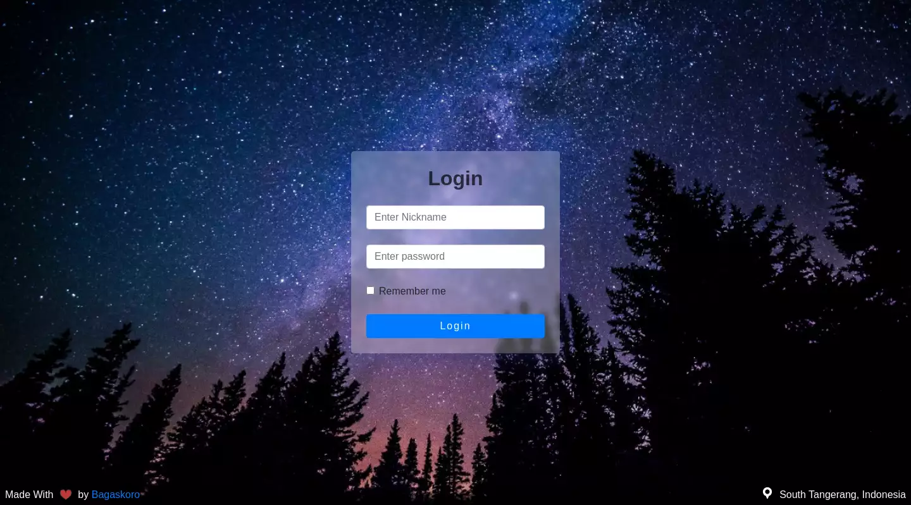
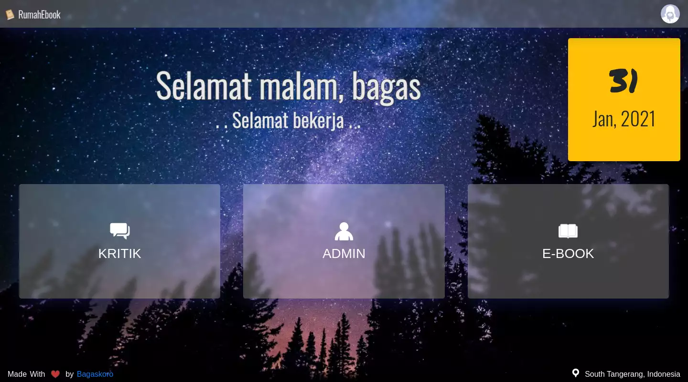
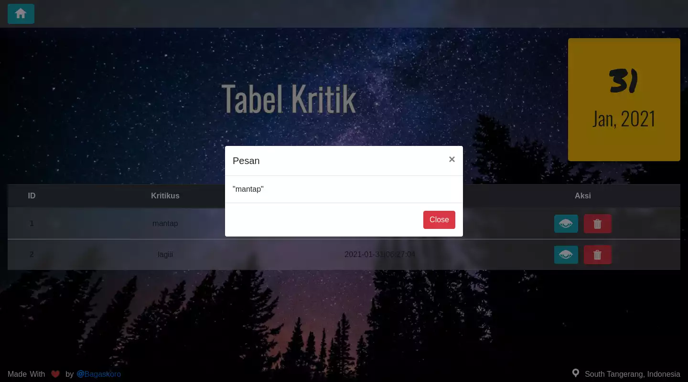
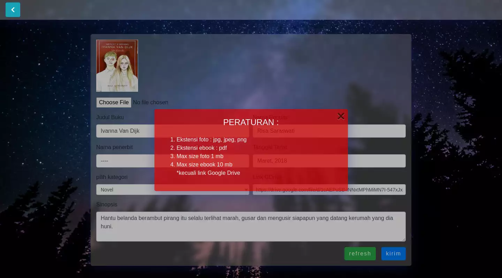

# THE WEB FOR EBOOK COLLECTIONS

## Tools & Stack
- [x] VS Code
- [x] PhpMyadmin
- [x] PHP Native (Procedural)
- [x] Bootstrap 4

## Features
* Login for Admin
* Admin Page
* Download Page
* Live Search
* Background changer (based of time)

## Screenshoot
Live Demo Can access at <a href="https://sumbangbuku.000webhostapp.com/">https://sumbangbuku.000webhostapp.com/</a>   
  
  
  
  
  
  
